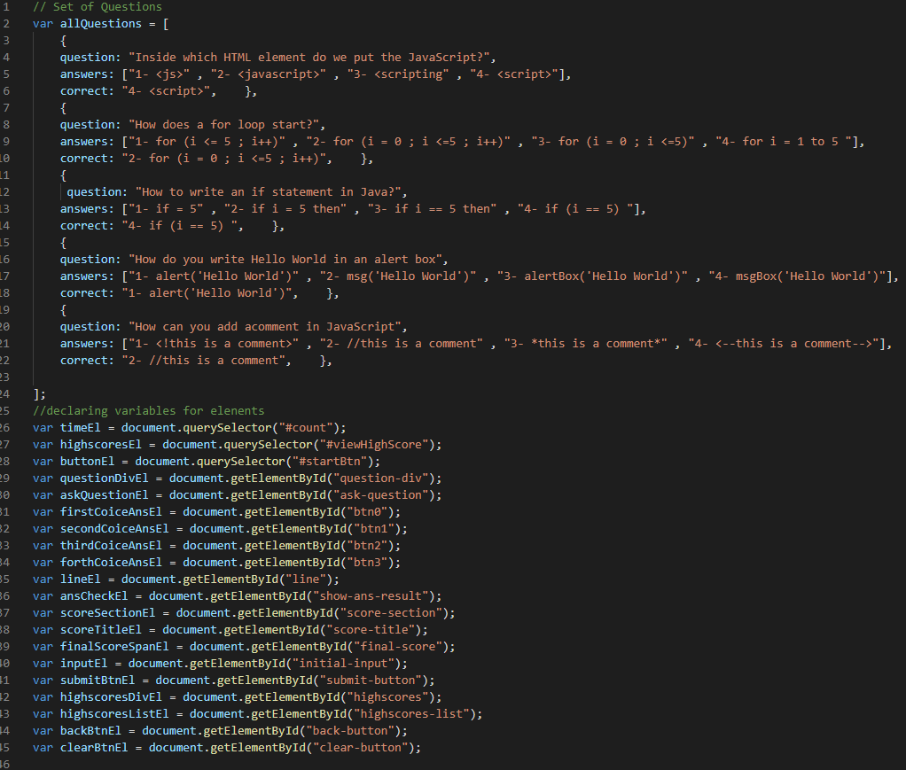

# JavaScript-Code-Quiz

## Description

Building a timed coding quiz with multiple-choice questions. This app will run in the browser and will feature dynamically updated HTML and CSS powered by JavaScript code that we write.

## Instalation

Please use the following link to view the deployed app after modification :[Deployed App](https://samer-balee.github.io/JavaScript-Code-Quiz/).

GitHub link : [Samer-Balee](https://github.com/Samer-Balee/JavaScript-Code-Quiz).

## Usage

1- Starting with set of variables and declare variables for elements 

2- Function to start quiz 

3- Function to start timer 

4- After each Question check answer 

5- function to store scores 

6- Add event listener 